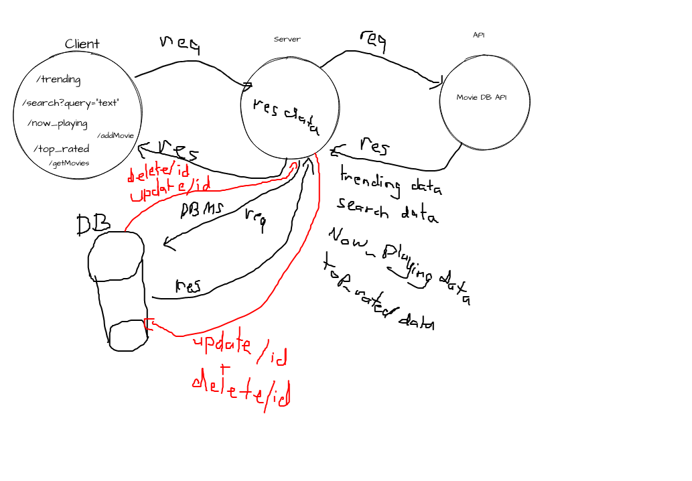
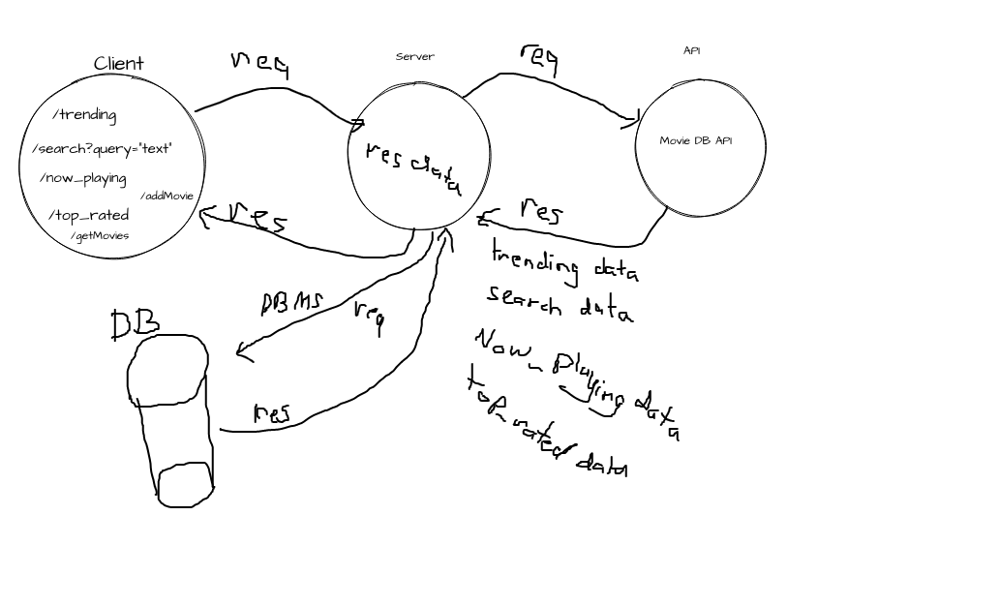
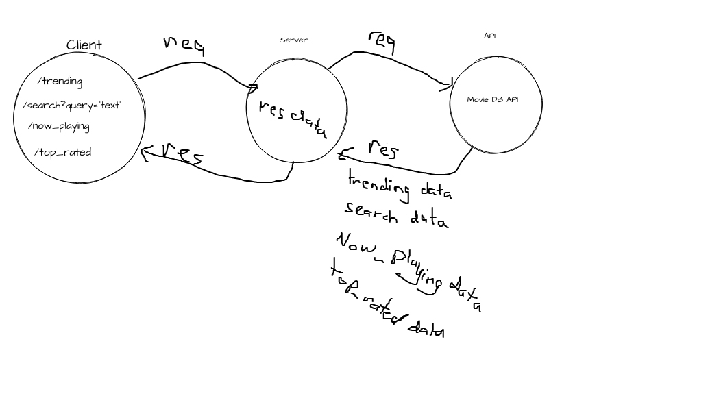
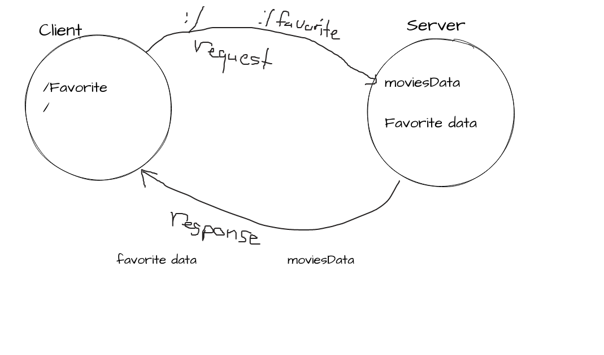

# Movies-Library
# Project Name - Project Version
# DataBase Added
**Author Name**: Motasem Sulaiman
# WRRC4

# WRRC3

# WRRC2

## WRRC

## Overview
Creating a server and make a request and response to retrive data from API and Data base and add CRUD fucntions to database
## Getting Started
-get your own API_KEY
-create new repo  
-Create basic file structure (server.js, .gitignore, .eslintrc.json ,.env)
 
-run the command command "npm init -y"  
-run the command npm install express cors 
-run the command npm i npm install axios dotenv 
-declare const express = require("express"); 
-const server=express()  
-declare port .. const port=3000; 
 
-download Thunder Client extension

## Project Features
-you can retrive the data from server or API or DATABASE and u can update and delete from DATABASE by writing one of paths(localhost:3001/favorite  , localhost:3001/ , localhost:3001/trending  , localhost:3001/search?query="text"  , localhost:3001/top_rated  ,localhost:3001/now_playing , localhost:3001/getMovie , localhost:3001/addMovie , localhost:3001/getMovies)  
-contain error handler (500,404)